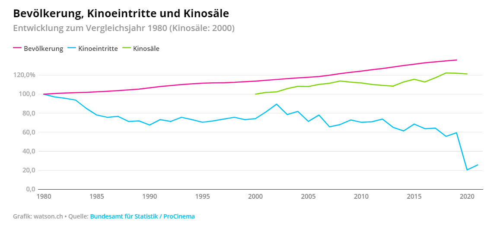
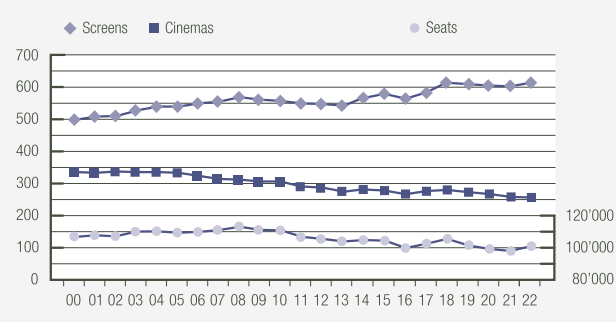
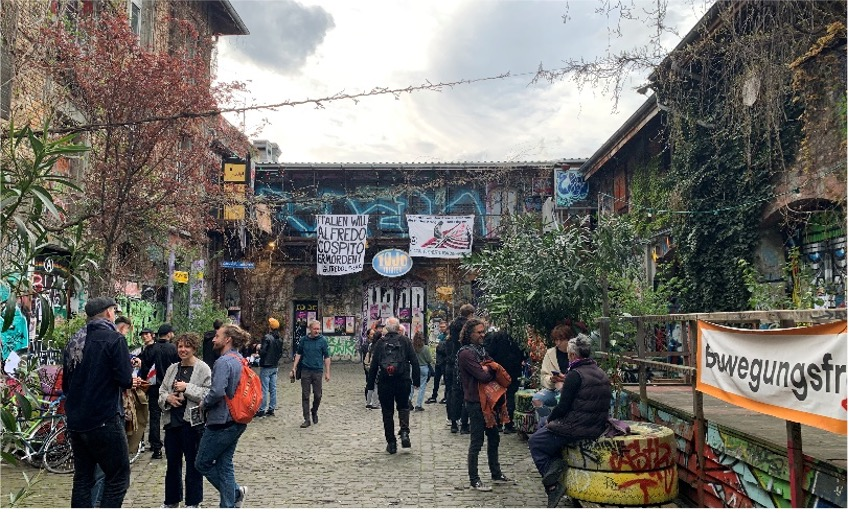
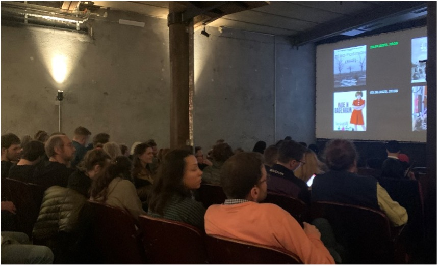
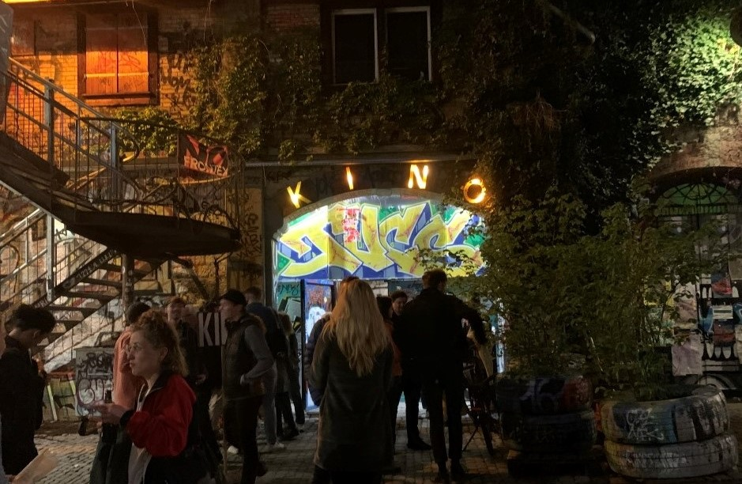

+++
title = "Vom Aussterben bedroht: Die Schweizer Kinos"
date = "2023-06-27"
draft = false
pinned = false
tags = ["Reportage", "Deutsch", "Kinosterben", "Kultur", "Film"]
image = "hehi.jpg"
description = "Steht das Todesurteil der Schweizer Kinos schon geschrieben?  \nUnd wie kann man deren Zukunft retten? \nEine Reportage von Sophie Fachruddin und Selen Kaya "
+++
Immer wieder liest man in den Nachrichten vom weltweiten Kinosterben. Während Streamingangebote wie Netflix, Amazon Prime und Disney+ immer beliebter werden, verliert die Kinobranche stetig an Besuchern. 
Die Besucherzahl ist in 2022 zwar deutlich gestiegen, verglichen mit den Coronajahren 2020 und 2021, aber der ‘Normalzustand’ der vorherigen Jahre ist immer noch nicht erreicht. Dieser Normalzustand ist aber auch nicht gerade erfreulich, da die Zuschauerzahl langfristig trotzdem am sinken ist.   

Betrachtet man weitere Statistiken der ProCinema, ist ein interessanter Trend zu erkennen: Während die Anzahl der Kinos stetig sinkt, steigt die Anzahl Leinwände. Es gibt also immer weniger, dafür immer grössere Multiplex-Kinos in der Schweiz.

Da stellt sich natürlich die Frage: Sind Multiplex-Kinos wie das Pathé Westside oder das BlueCinema der Tod der Einsaalkinos? Mehr dazu erfahren Sie im Interview mit René Gerber, dem Generalsekretär des ProCinema. 

> “Die Kosten sind einfach zu hoch für diese kleinen Kinos” 
>
> René Gerber



Das ProCinema ist der Schweizer Verband für Kino und Filmverleih. Der Verband beschäftigt sich mit den politischen und wirtschaftlichen Aspekten der Schweizer Kinobranche. Das ProCinema ist zuständig, allerlei Informationen über die Schweizer Kinobranche zu sammeln und diese Daten in Form von Statistiken und Ranglisten schweizweit zu publizieren. Eine weitere Aufgabe von ProCinema ist, Politiker*innen aufmerksam auf die Probleme der Kinobranche zu machen.

René Gerber ist Generalsekretär von ProCinema. Er erinnert sich besonders gerne an seinen sechsten Geburtstag, an dem er bereits seine Leidenschaft zum Film entdeckte. Er erzählt: “Da hat meine Mutter mich ins Kino gefahren und im Kino lief der Film Dschungel Buch."  Damals reichte ein Fünf-Fränkler für den Kinoeintritt und ein Eis in der Pause. Seine Liebe zum Kino vertiefte sich in der Lehre, da das Kino früher, laut René, ein Fenster zu fremden Welten war: “Damals gab’s in der Schweiz einen Fernsehsender, kein Internet und das Kino war eine Möglichkeit, auch in andere Länder reinzusehen.“ Ab dem Jahr 1989 arbeitete er in Zürich in einem Kino. Angefangen hat er als Operateur, Kassierer und Betriebsleiter. Dann wurde er Geschäftsführer einer Kinokette in Bern und seit 2002 hat er seine Karriere bei ProCinema angefangen. Von dort aus stieg er zum Generalsekretär auf. 




### Interview mit René Gerber, Generalsekretär von der Procinema Schweiz

**Was waren die positiven und negativen Entwicklungen der Kinobranche in den letzten Jahren?** 

Etwas, das positiv und auch ein wenig negativ ist, ist die Digitalisierung, die ungefähr 2010 begonnen hat. Das Positive daran ist, dass die kleineren Kinos viel schneller den Zugang zu grossen Filmen haben. Das ist aber gleichzeitig auch etwas Negatives, weil dann unter Umständen ein grosser Film auf 250-300 Leinwänden läuft. Da kann es sein, dass die Hälfte aller Kinos in der Schweiz denselben Film zeigen und das ist sicher nicht im Sinne der Kundschaft und der Angebotsvielfalt. Eher negativ ist die Furcht der Produzenten, speziell in Hollywood, Risiken einzugehen für neue Geschichten. Die Produzenten riskieren halt ihr Geld lieber für etwas, das einmal funktioniert hat, als etwas Neues zu machen. So verarmt das Angebot dann ein wenig.  

**Wird es das Überleben für kleine Kinos immer schwieriger?**

Es ist sehr unterschiedlich. Die letzten Jahre haben gezeigt, dass es für kleinere Kinos speziell in den Städten schwierig geworden ist, betrieben zu werden. Das hat mit hohen Mietkosten zu tun, aber auch damit, dass man in einem Einsaalkino eben nur einen Film zeigen kann, aber den selben  Personalaufwand hat wie in einem Kino mit vier oder fünf Sälen. Das heisst, die Kosten sind einfach zu hoch für diese kleinen Kinos. Das hat dazu geführt, dass, nachdem 2008 das Pathé Westside eröffnet wurde, sich die Zahl der Eintritte von ca. 900‘000 in der Stadt Bern auf etwa 1.2 bis 1.4 Millionen erhöht hat, inklusive Pathé Westside. Aber die Hälfte der Eintritte hat das Pathé Westside gemacht, das heisst, in der Stadt Bern sind bei den kleinen Kinos auf einen Schlag 300‘000 bis 400‘000 Eintritte weggefallen.
Solche grossen Multiplex-Kinos sind einfach lukrativer zu betreiben, weil die Personalkosten im Verhältnis zum Angebot nicht so gross sind. Auch für die Zuschauer sind Multiplex-Kinos unter Umständen interessanter, weil das Angebot eben einfach grösser ist.  

**Wie kann man das Publikum motivieren, trotz der Streamingdienste in die Kinos zu kommen?**  

Indem man betont, was das Alleinstellungsmerkmal des Kinos ist. Das ist eben nicht zuhause auf dem Sofa alleine Streamingdienste schauen, sondern mit anderen Leuten zusammen etwas zu erleben und den gleichen Film zu erleben.

**Man diskutiert viel darüber, ob und wie viel der Staat die Kinos finanzieren soll. Was ist ihre Meinung dazu? Oder soll das Geld mehr zur Filmbranche gehen?**

Das ist kein einfaches Thema. In der Schweiz gibt es einen Verfassungsartikel, der besagt, dass das Filmwesen in der Schweiz gefördert werden muss. Kulturförderung ist grundsätzlich Sache der Kantone, der Städte und Ortschaften. Beim Film ist das anders. Die Filmförderung unterliegt dem Bund. Was wir eigentlich im Moment auf der politischen Ebene fordern, ist, das man zuerst einmal das Kino als Kulturstätte akzeptiert. Wir sind der Meinung, Film ist Teil der Kultur. Und Kinos sind Kulturstätten. Deswegen sind wir der Meinung, dass man Kinos auch fördern soll. Das ist aber nicht möglich mit Bundesgeldern, sondern das muss über die Kantone laufen. Und das soll auch nur bei den Kinos passieren, die selber nicht überleben können. 

**Können Sie schlussendlich noch einmal zusammenfassen, wie die Kinos Ihrer Meinung nach idealerweise zukünftig aussehen sollen?** 

Kennen Sie den Ort Schöftland? Dort gibt es seit etwa zehn Jahren ein Kino, das Cinema8. Es ist ein Fünfplex, der Komplex hat also fünf Säle. Er hat drei Restaurants, vier Bars, eine Bowling-Alley, eine Go-Kart-Bahn vor dem Kinosaal und es hat ein Hotel, das in gewissen Zimmern direkten Zugang zum Kinosaal anbietet. Man kann dort einen ganzen Tag sich total gut unterhalten. So könnte Kino aussehen. So kann man das Kino zum Treffpunkt machen, zu dem man eben auch hingeht, wenn man nicht nur Filme schauen will. Um etwas zu trinken und Freunde zu treffen.  



### Ein Kino ohne Konsumzwang

Ein kleines Programmkino in Bern ist das Kino in der Reitschule. Im Gespräch mit den Kollektivmitgliedern, die das 35 Jahre alte Kino organisieren, erfuhren wir viel über die Ziele und Motivationen hinter dem Kino. Das Kino ist als Kollektiv organisiert, das heisst, dass es durch Freiwilligenarbeit getragen wird. Weil das Kino nicht gewinnorientiert ist, gibt es auch keinen zwingenden Eintritt. Die Kosten der Filme werden durch Spendengelder finanziert. Das Einsaalkino der Reitschule legt seinen Fokus stark auf politische Themen. Auf ihrer Website heisst es, sie wollen:

> «Geschichten von Menschen erzählen lassen, die etwas mit uns zu tun haben, die zeigen, in welchen gesellschaftlichen Verhältnissen und Verstrickungen sie gefangen sind und wie sie sich mit ihnen auseinandersetzen». 
>
> http://kino.reitschule.ch/

Die Filmauswahl wird jeweils monatlich an einem Kollektivtreffen bestimmt. Die Filme passen immer in eines der politisch aktuellen Themenkomplexe, die sich teilweise über Monate hinwegziehen. Das Ziel ist, eine gründliche Auseinandersetzung mit der Thematik zu erreichen.

### Ein Freitagabend im Programmkino

Selen und ich (Sophie) schauten uns den Dokumentarfilm ‘The DNA of Dignity’ zum Thema ‘Frieden und Krieg’ an. Es war mein erster Besuch in dem Kino in der Reitschule. Es war erst Ende April, aber bei den 21°C konnte man sich schon fast einreden, es wäre ein warmer Sommerabend. Schon von Weitem konnte ich erkennen, in welche Richtung das Kino war.  

Denn vor dem Kinoeingang standen Menschen jeglichen Alters in kleinen Grüppchen und es lag eine entspannte Atmosphäre in der Luft. Als wir uns 10 Minuten vor Beginn dazu entschieden reinzugehen, war es fast schon zu spät: Der Raum war gefüllt.

Die Stimmung war drinnen gleich wie draussen: Zu hören war ausgelassenes Plaudern und Gelächter. Die Jüngeren machten es sich auf den Sofas in der vordersten Reihe bequem. Es sah so aus, als hätte sich eine ganze Freundesgruppe dazu entschieden, vor dem Ausgang noch gemeinsam einen Film zu schauen.
Wir überlegten uns, angesichts des Platzmangels an der Bar zu sitzen. Doch in der vordersten Reihe hatte es noch zwei freie Sitze neben einem älteren Mann. Wir setzten uns hin und ich begann, mit ihm Smalltalk zu führen. Er wirkte nett und erklärte uns, wieso er trotz den heutigen Möglichkeiten des Streamings noch gerne ab und zu ins Kino kommt. Er meinte, es sei einfach etwas anderes als zuhause: die Leute, die Gespräche, die Filmqualität. Der wirklich springende Punkt für ihn sei aber die Filmauswahl. Man kann diesen Film nämlich gar nicht online streamen. Ausserdem sei es die Erstaufführung in Bern und der Regisseur sei auch vor Ort, das wäre schon etwas Besonderes für ihn.\
Bevor wir weiter sprechen konnten, wurde unser Gespräch von lautem Applaus und Gejubel unterbrochen. Der Regisseur Jan Baumgartner trat nach vorne. Er sprach über die Idee hinter seinem Film und über die Dreharbeiten. Andrea, ein Mitglied des Kollektivs, mit dem wir uns im Vorfeld schon unterhalten durften, bedankte sich für die zahlreichen Gäste. Er machte noch die Bemerkung, dass der gefüllte Raum leider «ein seltener Anblick» sei. Nach einem zweiten Applaus ging es los. 
Der Film thematisierte das Leben derjenigen, die im Jugoslawienkrieg jemanden verloren hatten, dessen Körperteile nun mithilfe DNA-Tests identifiziert werden konnten. Er stellte eine neue Perspektive auf die Folgen des Krieges dar. Viele Szenen zeigten das Ausgraben von Massengräbern, das Zersägen und Zermörsern der gefundenen Knochen. Es wurde teilweise so morbid, dass mir ein wenig schlecht wurde. Doch genau darum ging es ja: Die Darstellung der Realität tausender Menschen, deren Leben durch diese DNA-Proben drastisch verändert werden.\
In der Mitte des Filmes konnte man die ersten Geräusche schnäuzender Nasen hören. Selen flüsterte mir leise zu: «Dr Maa nebe üs grännet.» Ich sah mich kurz um und bemerkte, dass dem älteren Mann neben mir die Tränen in den Augen standen. Als ich mich wieder Selen zuwandte, war sie auch schon dem Weinen nahe. 

Nach dem Film führte ein Kollektivmitglied mit dem Regisseur Jan Baumgartner ein Interview. Es wurden auch viele Fragen vom Publikum gestellt. Ab und zu machte der Regisseur einen kleinen Witz, worauf Gelächter ausbrach. Im Wissen, dass alle in den letzten Stunden denselben Film gesehen hatten und über dasselbe Thema redeten und nachdachten, entstand ein gewisses Gemeinschaftsgefühl. 
Nach der Aufführung wurde man dazu motiviert, den Film gemeinsam zu besprechen. Das vorrangige Ziel des Kollektivs war ganz klar, Gespräche zu erzeugen und so auf die Themen aufmerksam zu machen. 

Das Publikum versammelte sich nochmal im Innenhof. Es wurde wieder diskutiert, nur viel belebter als vor dem Film. 

Insgesamt war unser Kinobesuch eine bereichernde Erfahrung. Der Film hatte viele wichtige Fragen zum Krieg thematisiert und brachte uns zum Nachdenken. Es war schön, ein Einsaalkino zu sehen, das trotz der Schwierigkeiten ein zahlreiches Publikum anziehen kann.

### Ein Ausweg aus dem Kinosterben

Und genau das, denken wir, macht den grossen Unterschied zum isolierten Streaming. Nicht die grosse Leinwand oder die gute Tonqualität oder sogar die spezielle Filmauswahl. Ein Kinobesuch ist ein soziales Event, bei dem man sich mit seinen Freunden und vielen Unbekannten mehrere Stunden auf ein bestimmtes Thema einlässt und gemeinsam dazulernt. Genauso wie René Gerber es gesagt hat:

> „Nicht zuhause auf dem Sofa alleine Streamingdienste schauen, sondern mit anderen Leuten zusammen etwas zu erleben.“
>
> René Gerber

Wir denken, diesen sozialen Aspekt weiter zu fördern, so wie es das Kino in der Reitschule schon macht, kann das weitere Kinosterben verhindern. Es gibt viele Arten, diese Eventisierung zu fördern. Konkrete Beispiele in Bern sind Diskussionsrunden, Interviews mit Schauspielern und Regisseuren, themenbezogene Referate und Filmgespräche. An anderen Orten in der Schweiz verbindet man das Kinoerlebnis mit Gastroangeboten und Hotels (BlueCinema in Chur, Cinema8 in Schöftland) oder führt ‘Filme on demand’ ein, bei dem die Zuschauer selbst direkt über die Filmauswahl abstimmen können (theoneswelove.ch)

Mit all diesen Massnahmen sind wir uns sicher, dass sich die Kinos auch weiterhin ihren Platz in der Kulturbranche sichern können.