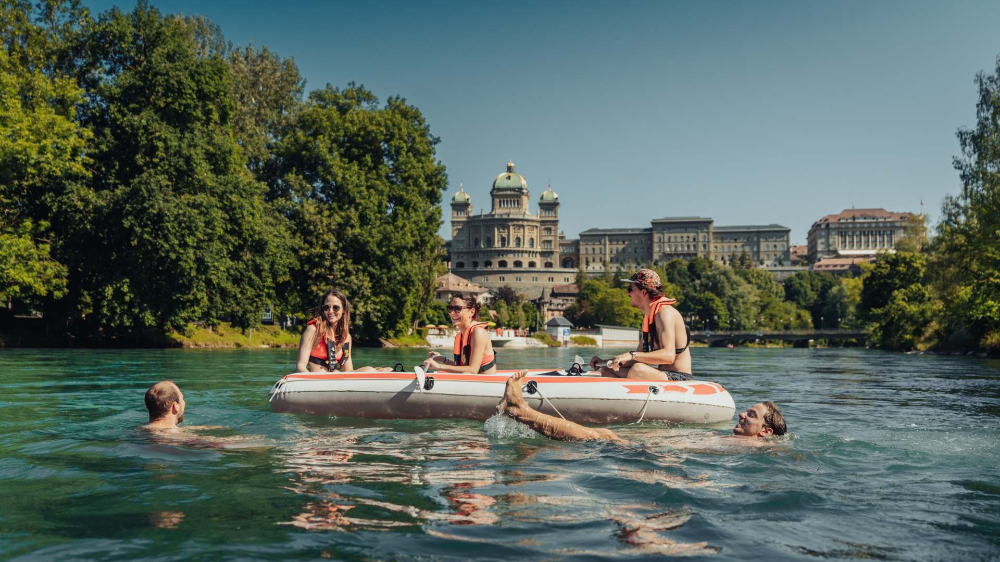

+++
title = "L'Aar de Berne"
date = "2023-04-25"
draft = false
pinned = false
tags = ["l'aar", "nager", "berne", "cartepostalesonore"]
image = "aare-shooting_2020_c_bew-22-2462f95e.jpg"
description = "Une carte postal sonore de l'Aar"
footnotes = ""
+++
<!--StartFragment-->

<!--EndFragment-->

**Qu'est-ce qu'une carte postale sonore?**

C'est une portrait d'un lieu on peux écouter. Sur laquelle on utilise les bruits de ce lieu et on le décrit.

Melinda et moi avons choisi l'Aare parce que nous aimons nager bien. Mais malheuresement, parce que Melinda fait une échange sur la Romandie, nous ne pouvons pas enregistrement notre audio sur l'Aare réel. Pour réplacer le sentiment, j'ajoute les bruits 'fake'. 

<iframe width="100%" height="300" scrolling="no" frameborder="no" allow="autoplay" src="https://w.soundcloud.com/player/?url=https%3A//api.soundcloud.com/tracks/1503867688%3Fsecret_token%3Ds-FAscC8ufnFM&color=%23ff5500&auto_play=false&hide_related=false&show_comments=true&show_user=true&show_reposts=false&show_teaser=true&visual=true"></iframe>
<a href="https://soundcloud.com/sophie-129018770" title="Sophie" target="_blank" style="color: #cccccc; text-decoration: none;">Sophie</a> · <a href="https://soundcloud.com/sophie-129018770/video-output-6d2dac8d-7709-4635-9255-dc300c04058f-online-audio-convertercom/s-FAscC8ufnFM" title="Video - Output - 6D2DAC8D - 7709 - 4635 - 9255 - DC300C04058F (online - Audio - Converter.com)" target="_blank" style="color: #cccccc; text-decoration: none;">Video - Output - 6D2DAC8D - 7709 - 4635 - 9255 - DC300C04058F (online - Audio - Converter.com)</a>
